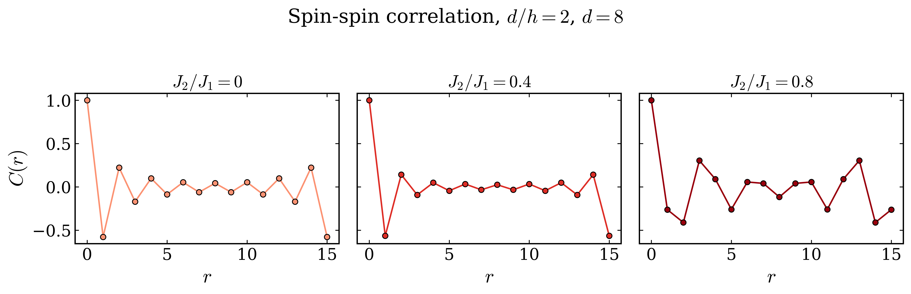

# NetKet CQP: JAX variational Monte Carlo for J1-J2 spin chains

This repository contains a JAX implementation of a Vision-Transformer-inspired
variational wavefunction for one-dimensional spin-1/2 J1-J2 Heisenberg chains.
It supports a dependency-light JAX workflow and optional NetKet/Flax adapters
for the corresponding NetKet workflow.

The project studies how transformer architecture choices affect variational
Monte Carlo accuracy and computational cost for frustrated quantum spin chains.



## What is included

- `ViTWaveFunction`: factored-attention ViT with a complex RBM/log-cosh head.
- `J1J2Hamiltonian`: JAX local-energy evaluator and optional NetKet operators.
- `VMCSampler`: JAX up-down exchange sampler that preserves total spin-z.
- `SROptimizer`: stochastic-reconfiguration optimizer for complex wavefunctions.
- Reproducible notebooks, curated `.npz` results, timing data and figures.

## Installation

Use Python 3.11, 3.12 or 3.13. Create a clean environment, then install the
core package with notebook and test dependencies:

```bash
python -m venv .venv
source .venv/bin/activate       # Windows: .venv\\Scripts\\activate
python -m pip install --upgrade pip
python -m pip install -e ".[analysis,dev]"
```

For the optional NetKet/Flax integration, install:

```bash
python -m pip install -e ".[analysis,dev,netket]"
```

## Minimal JAX example

```python
import jax

from netket_cqp import J1J2Hamiltonian, SROptimizer, VMCSampler, ViTWaveFunction

L = 16
model = ViTWaveFunction(L=L, b=4, n_layers=1, d_model=32, n_heads=4, d_ff=128)
params = model.init(jax.random.PRNGKey(0))

sampler = VMCSampler(model, L=L, n_chains=32, seed=0)
sampler.reset(params)
hamiltonian = J1J2Hamiltonian(L=L, J1=1.0, J2=0.4)
optimizer = SROptimizer(model, lr=0.01, diag_shift=1e-4, batch_size=128)

states, _, _ = sampler.sample(params, n_samples=20, burn_in=50, thin=5)
configs = states.reshape(-1, L)
local_energy = hamiltonian.local_energy(model, params, configs)
params, update_norm = optimizer.step(params, configs, local_energy)
sampler.refresh(params)
```

For an unfrustrated chain (`J2 = 0`), use either `marshall_sign=True` on the
wavefunction or `sign_rule=True` on the Hamiltonian—never both, because they
apply the same nearest-neighbour sign transformation twice.

## Reproduce the notebooks

Launch Jupyter from the repository root:

```bash
jupyter lab
```

`notebooks/main.ipynb` runs an example experiment and writes results to
`results/netket_outputs/`. `notebooks/plots.ipynb` and
`notebooks/additional_plots.ipynb` analyze the curated results already included
in the repository. Output cells were cleared before publication; rerun notebooks
in numerical order to produce fresh results.

## Tests

```bash
python -m pytest
```

The same core test suite runs automatically on GitHub Actions for Python 3.11,
3.12 and 3.13. The optional NetKet integration is deliberately not part of the
default test job because it has a separate dependency stack.

## Repository layout

```text
src/netket_cqp/       Python package
tests/                Fast automated tests
notebooks/            Experiment and analysis notebooks
data/time_dof/        Timing data used in scaling analyses
results/netket_outputs/ Curated experiment outputs
figures/              Plots used in this README and analysis
REFERENCES.md         Tutorial and implementation references
```

See [DATA.md](DATA.md) for the policy on data and generated experiment files,
and [REFERENCES.md](REFERENCES.md) for the methodological references.

## License

Released under the [MIT License](LICENSE). If you use this work in research,
please cite the repository; see [CITATION.cff](CITATION.cff).

## Reference

This project adapts the ViT neural quantum state architecture to the
one-dimensional J1-J2 Heisenberg chain.

Viteritti, L. L., Rende, R., and Becca, F.
*Transformer variational wave functions for frustrated quantum spin systems*
(2022), arXiv:2211.05504.  
https://arxiv.org/abs/2211.05504
